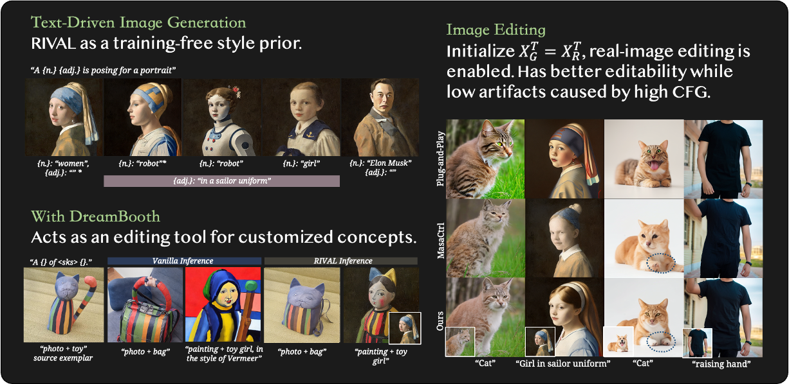
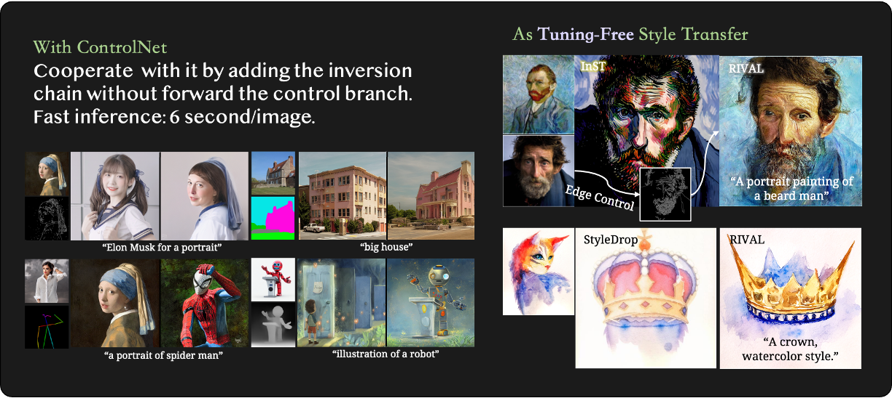
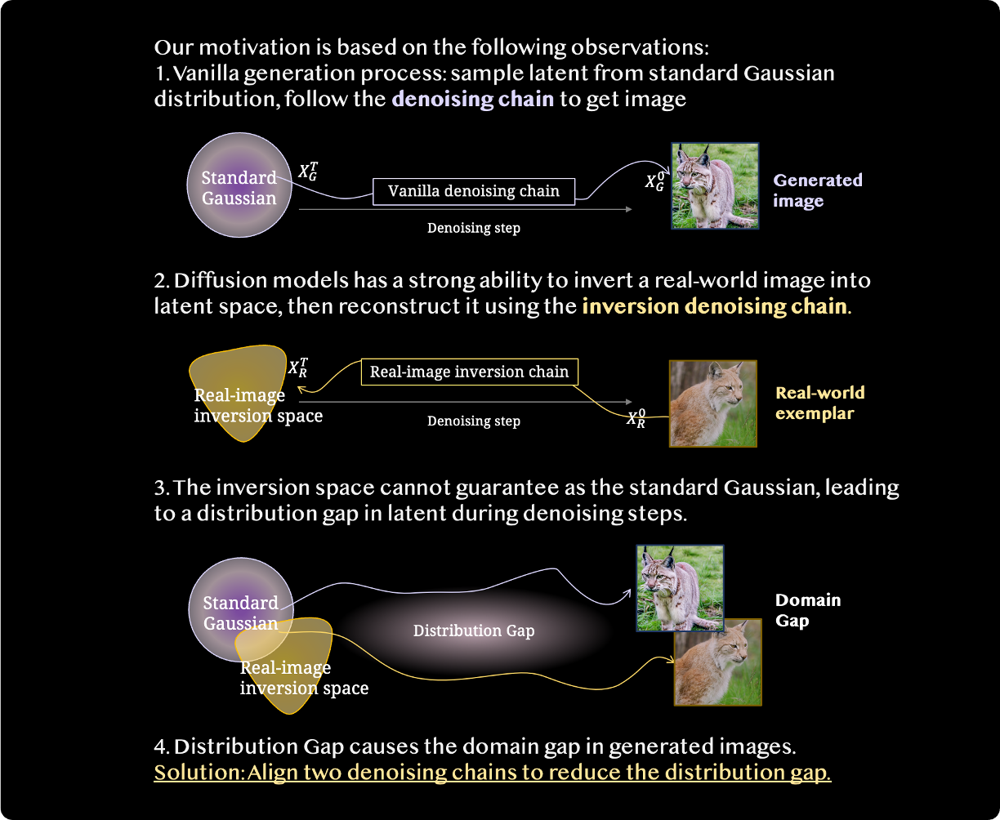
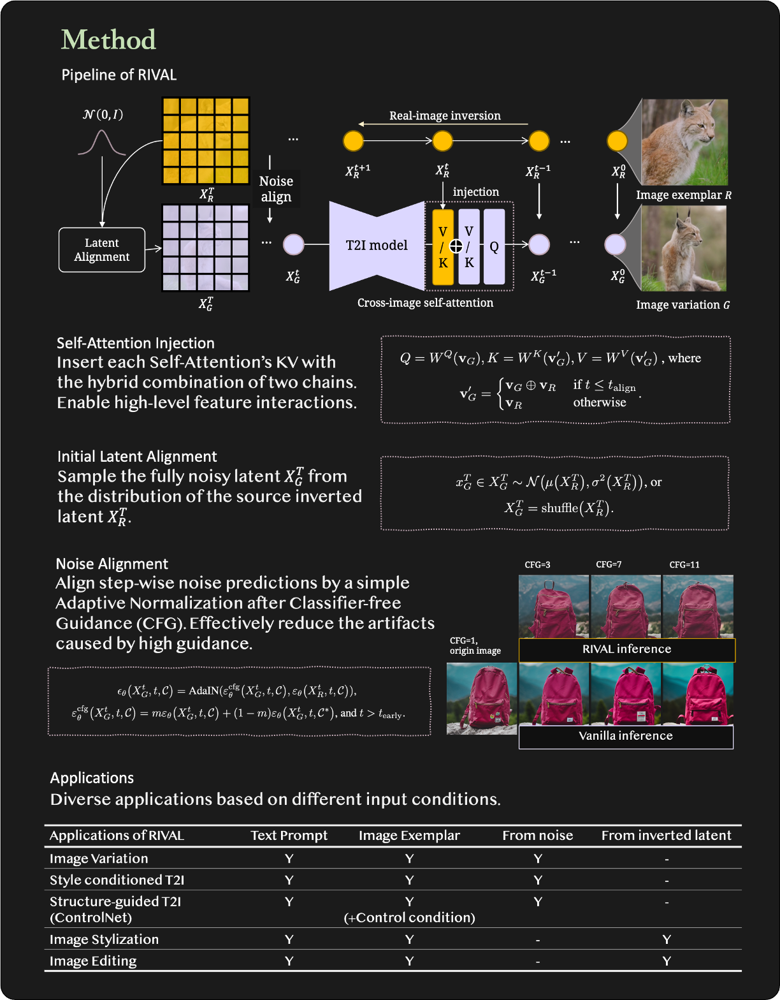

#  RIVAL
**[NeuIPS 2023 Spotlight]** Official Implementation of paper *Real-World Image Variation by Aligning Diffusion Inversion Chain*
[[PDF](assets/Zhang_NeurIPS_2023_RIVAL_Cam_ready_paper.pdf)] [ [arXiv](https://arxiv.org/abs/2305.18729) ] [ [Project Page](https://rival-diff.github.io/) ]


## Project MileStones
- [x] [20231028] Code release for the image variations and text-to-image
- [x] [20231030] Code release for ControlNet inference, image editing
- [x] [20231031] Code release for other applications (like +inpainting), user manual
- [ ] [202311xx] Code release for SDXL, and other possible applications

## Applications and User Manual
We provide several examples with five applications, variations, T2I, editing, inpainting, and ControlNet.
#### Enviornment setting:
Please raise an issue/PR if you have problems in env setting.
```bash
conda create -n rival python=3.9.16
conda activate rival
pip3 install torch torchvision torchaudio --index-url https://download.pytorch.org/whl/cu118
pip install -r requirements.txt
conda install xformers -c xformers
```
#### The usage of hyper-params
All applications has a config file for inference. Following shows a brief explanation for some key parameters.
```json
{
    "self_attn":
    {
        "atten_frames": 2,
        "t_align": 600 # [0-1000], smaller means closer to the original image (semantically).
    },
    "inference":
    {
        "invert_step": 50,
        "ddim_step": 50,
        "cfg": 7,
        "is_null_prompt": true, # whether use empty prompt "" in inversion.
        "t_early": 600 # [0-1000], smaller means closer to the original image (low-level color distribution).
    }
}
```
In test python file (e.g., rival/test_variation_sdv1.py):

- `--inf_config`: Inference config file. default="configs/rival_variation.json"
- `--img_config`: Data config file. default="assets/images/configs_variation.json"
- `--inner_round`: How many images you want to generate per reference. default=1
- `--exp_folder`: Output folder. default="out/variation_exps"
- `--pretrained_model_path`: SD model path. default="runwayml/stable-diffusion-v1-5"
- `--is_half`: Whether use fp16.  default=False
- `--is_editing`: If set True, we do not permute inverted latent. default=False
- `--editing_early_steps`: For t > step, do normal inference in self-attention. default=1000

## Image Variations

With a reference image, RIVAL generate images with the same semantic contents and style, without any optimization.
```bash
bash scripts/rival_variation_test.sh
```

## Editing-based applications

### Image Editing
Users can modify the `editing_early_steps` in this script to contorl the editing strength.
```bash
bash scripts/rival_editing_test.sh
```

### Customized Concept Editing
[under-construction] With RIVAL, we can customize both object concept and style concept that is hard be described.
```bash
bash scripts/rival_custom_test.sh
```

### Example-Based Inpainting
Please note that its application scope is indeed limited (as shown in the paper, the example can only come from itself).
```bash
bash scripts/rival_inpainting_test.sh
```

## Generation-based applications

### Text-Driven Image Generation
```bash
bash scripts/rival_t2i_test.sh
```

### Generation with controlNet
The config example is given in `assets/images/configs_controlnet.json`, you may enable more modalities by editing the python script.
```bash
bash scripts/rival_controlnet_test.sh
```

## Motivation and Method



## BibTeX
```bibtex
@article{zhang2023realworld,
  title={Real-World Image Variation by Aligning Diffusion Inversion Chain}, 
  author={Yuechen Zhang and Jinbo Xing and Eric Lo and Jiaya Jia},
  journal={arXiv preprint arXiv:2305.18729},
  year={2023},
}
```
