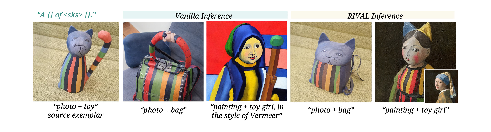
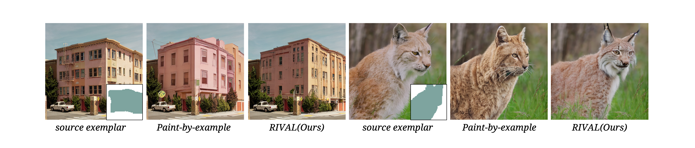
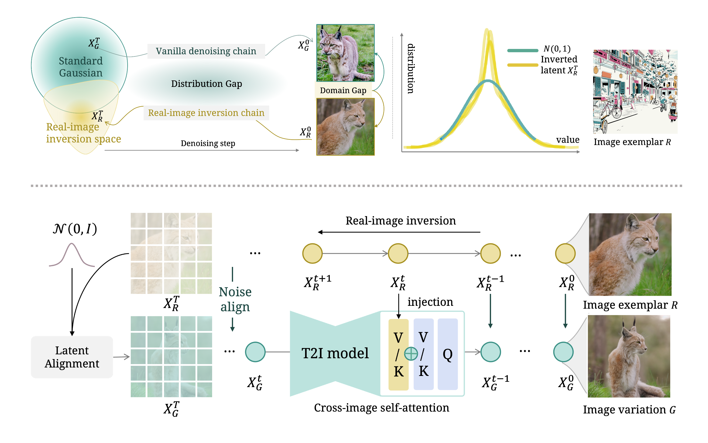

#  RIVAL
Real-World Image Variation by Aligning Diffusion Inversion Chain
[ [arXiv](https://arxiv.org/abs/2305.18729) ] [ [Project Page](https://rival-diff.github.io/) ] 
## Applications
### Image Variations

> With a reference image, RIVAL generate images with the same semantic contents and style, without any optimization.

### Free-Form Image-Conditioned Generation

> With a reference image, we can input different prompts to control the generation, like a tunning-free style transfer.


### Customized Concept Editing

> With RIVAL, we can customize both object concept and style concept that is hard be described.

### Example-Based Inpainting


## Method

Our motivation is based on the following observations: <br />
<li> Vanilla generation process: sample latent from standard Gaussian distribution, follow the <b
    style="color: #00AA99">denoising chain</b> to get image
<br />
<li> Diffusion models has a strong ability to invert a real-world image into latent space, then
reconstruct it using the <b style="color: #cba320">inversion denoising chain</b>.
<br />
<li> The inversion space cannot guarantee as the standard Gaussian, leading to a distribution gap in
latent during denoising steps.
<br />
<li> Distribution Gap causes the domain gap in generated images.
<br />
<b> Our Solution: Align two denoising chains to reduce the distribution gap. </b>
<br />
<br />

>To address this distribution gap problem for generating image variations, we propose an inference pipeline
          called Real-world Image Variation by Alignment (RIVAL). RIVAL is a tunning-free approach that reduces the
          domain gap between the generated and real-world images by aligning the denoising chain with the real-image
          inversion chain. Our method comprises two key components: (i) a cross-image self-attention injection that
          enables cross-image feature interaction in the variation denoising chain, guided by the hidden states from the
          inversion chain, and (ii) a step-wise latent normalization that aligns the latent distribution with the
          inverted latent in early denoising steps. Notably, this modified inference process requires no training and is
          suitable for arbitrary image input.


## BibTeX
```bibtex
@article{zhang2023realworld,
  title={Real-World Image Variation by Aligning Diffusion Inversion Chain}, 
  author={Yuechen Zhang and Jinbo Xing and Eric Lo and Jiaya Jia},
  journal={arXiv preprint arXiv:2305.18729},
  year={2023},
}
```